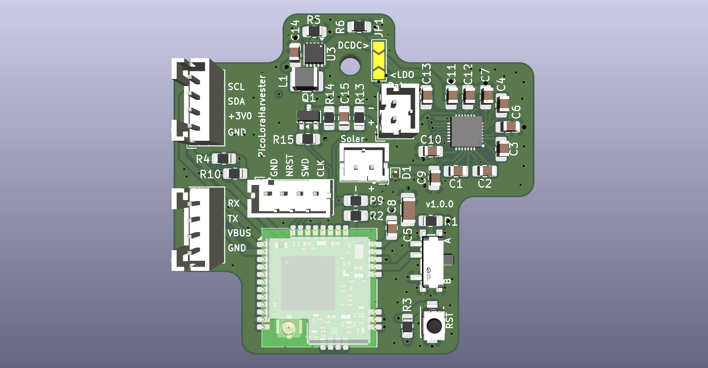

!! Warning !! Untested layout yet.



# PicoLoRaHarvester

## What is this thing?

This PCB integrates a [RAK3172 LoRa module](https://docs.rakwireless.com/Product-Categories/WisDuo/RAK3172-Module/Datasheet/) (STM32WLE5) with a [Nexperia NEH7100](https://assets.nexperia.com/documents/data-sheet/NEH7100.pdf) energy harvesting PMIC. 

Main target are solar-powered LoRa nodes that run unattended in off-grid locations.

The board is compatible to Meshcore and Mesthastic. But basically it's a nice platform for all kind of LoRa(WAN) harvesting stuff.

Beware that both firmwares need Power Saving patches (Semtech RX duty cycle and uC deep sleep) due to the limited harvesting capability of the IC.


## Features

* Energy harvesting via Nexperia NEH7100 PMIC: 15 μW to 100 mW input range, up to 95% efficiency
* Compatible to basically all all 1-cell energy storage: LiPo, LiFePo4, LTO, Supercaps, etc.
* Storage Type, OVP/UVP/etc. can be configured with solder bridges on the back
* With a soldering bridge you can either go for the internal Nexperia NEH7100 LDO (for low BOM) or use a TI TPS63900 Buck-Boost Converter
* USB bypass charging (VUSB) at up to 200 mA via the UART connector
* Battery (ADC_LIPO) voltage monitoring using a voltage divider, on/off switchable with a n-Mosfet
* I²C Infineon FRAM (FM24V10) on the back for data logging 


## Physical Outlines

| Dimension | Value |
|-----------|-------|
| Width | 50.54 mm |
| Height | 45.50 mm |

Fits into this box: [Aliexpress, F-type, 63x58x35](https://de.aliexpress.com/item/1005005480970197.html).

Yes - the mounting hole is not symmetric. 

## Pinout

### Connectors

| Designator | Connector | Pins | Purpose |
|------------|-----------|------|---------|
| J1 | Pin header 1x06 (1.00 mm) | 1: GND, 2: +3V0, 3: SPI1 SS (PA4), 4: SPI1 CLK (PA5), 5: SPI1 MISO (PA6), 6: SPI1 MOSI (PA7) | SPI expansion bus (SPI1) |
| J2 | JST PH 2-pin | 1: VBUS, 2: GND | Solar panel input (feeds NEH7100 energy harvester) |
| J3 | JST PH 4-pin | 1: GND, 2: VUSB, 3: UART TX, 4: UART RX | UART + USB bypass charging (200 mA) |
| J4 | JST PH 2-pin | 1: VLIPO, 2: GND | LiPo battery |
| J5 | JST PH 4-pin | 1: GND, 2: +3V0, 3: I2C1 SDA, 4: I2C1 SCL | I²C expansion bus (I2C1) |
| J6 | JST PH 4-pin | 1: GND, 2: NRST, 3: SWD, 4: SWCLK | SWD debug/programming |

### RAK3172 Pin Mapping

| RAK3172 Pin | Function | Connected To |
|-------------|----------|-------------|
| PA2 | UART2 TX | J3 pin 3 |
| PA3 | UART2 RX | J3 pin 4 |
| PA4 | SPI1 SS | J1 pin 3 |
| PA5 | SPI1 CLK | J1 pin 4 |
| PA6 | SPI1 MISO | J1 pin 5 |
| PA7 | SPI1 MOSI | J1 pin 6 |
| PA9 | I2C1 SCL | J5 pin 4 |
| PA10 | I2C1 SDA | J5 pin 3 |
| PA11 | I2C2 SDA | NEH7100 SDA (PMIC config bus) |
| PA12 | I2C2 SCL | NEH7100 SCL (PMIC config bus) |
| PA13 | SWDIO | J6 pin 3 |
| PA14 | SWCLK | J6 pin 4 |
| PB3 / A0 | GPIO out | EN_VOL_DIVIDER (Q1 n-MOSFET load switch for the ADC_LIPO divider) |
| PB4 / A1 | ADC | ADC_LIPO (battery voltage divider, R13/R14 + C15) |
| BOOT0 | Bootloader | SW1 (SSSS811101 slide switch) via R1 (10 kΩ) |
| NRST | Reset | SW2 (push button), J6 pin 2 |

### I²C Bus Allocation

| Bus | Pins | Purpose |
|-----|------|---------|
| I2C1 | PA9 (SCL), PA10 (SDA) | J5 expansion connector for external sensors/peripherals |
| I2C2 | PA12 (SCL), PA11 (SDA) | NEH7100 PMIC telemetry and configuration |

Both I²C buses have on-board 10 kΩ pull-up resistors (R4/R10 for I2C1, R2/R9 for I2C2).

## Voltage Monitoring

| Net | Divider | Ratio | RAK3172 ADC Pin |
|-----|---------|-------|-----------------|
| ADC_LIPO | R13 (390 kΩ) / R14 (1 MΩ) + C15 (100 nF) | ~0.72 | PB4 / A1 |


## Power Architecture

```
Solar Panel (J2) ── VBUS ── NEH7100 VIN (charge pump + MPPT)
USB 5V   (J3)   ── VUSB ── NEH7100 USB (bypass, 200 mA max)
LiPo     (J4)   ── VLIPO ── NEH7100 VBAT / VBATOK
                              │
                              ├─ Internal 4-stage charge pump
                              ├─ CSTORE bulk capacitor (47 μF, C10)
                              ├─ BLOAD load switch
                              └─ VLDO ──┐
                                        ├─ JP1 ── +3V0 rail (regulated 3.0 V)
                                        └─ TPS63900 (U3) VIN ── VOUT ──┘
                                              │
                                              ├─ RAK3172 VDD
                                              ├─ I2C pull-ups
                                              └─ J5 pin 2 (+3V0 output)
```


## FAQ

#### How much current can I expect from the NEH7100?

The NEH7100 has an input power range of 15 μW to 100 mW and efficiency up to 95% (per [datasheet](https://assets.nexperia.com/documents/data-sheet/NEH7100.pdf)). At the 3.0 V LDO output this translates to an absolute maximum of ~31 mA from harvested energy.

The USB input (VUSB on J3 pin 2) bypasses the charge pump and can supply up to 200 mA directly for bench use or supplemental charging.

#### Why the NEH7100 instead of the TI BQ25570?

* Voltage thresholds (OVP, LVD, LDO) are set by hard-code pins or I²C registers. The BQ25570 programs them with external resistor dividers, which adds resistor tolerance to every threshold and a permanent leakage path across the battery.
* The charge current can be read back over I²C (I_MEASURED/I_RANGE registers). The BQ25570 has no digital interface.
* External circuit consists of capacitors only. The BQ25570 needs an inductor each for its boost charger and buck converter.
* The pinout groups the flying caps, I²C and power pins by side, so routing needs no crossovers and there are no switching inductor loops to keep tight.


## License

CERN-OHL-S-2.0
